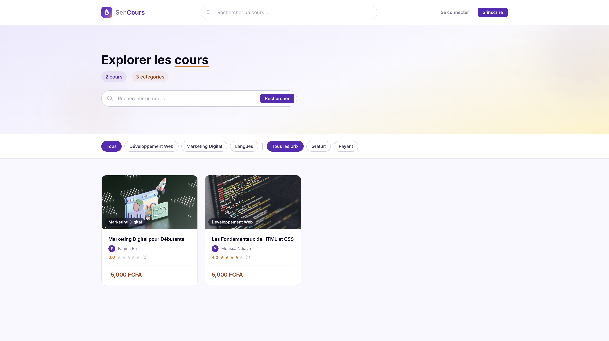
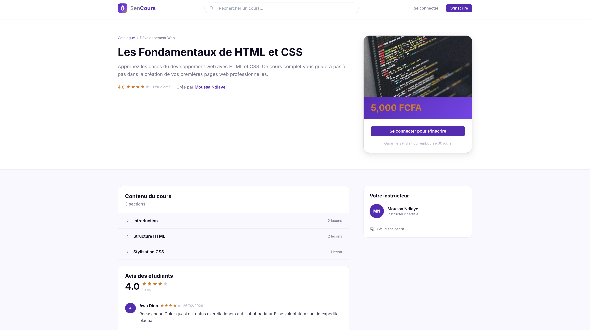
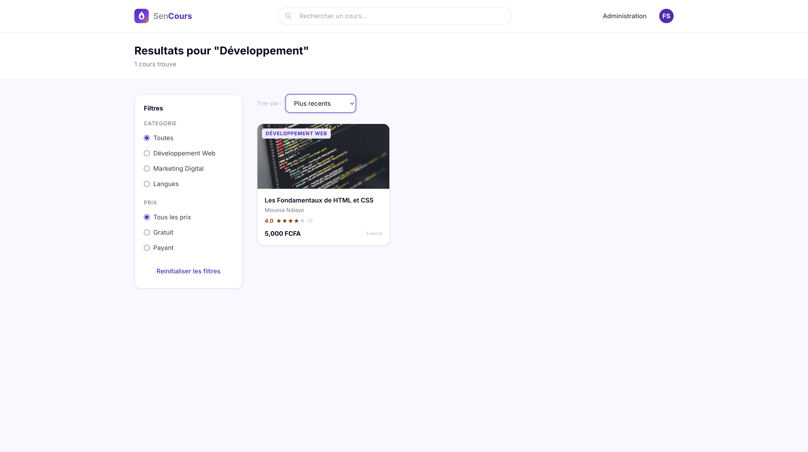
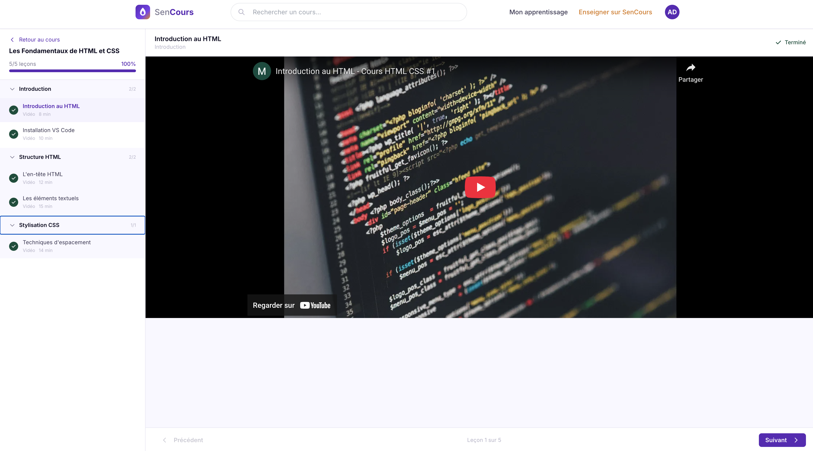
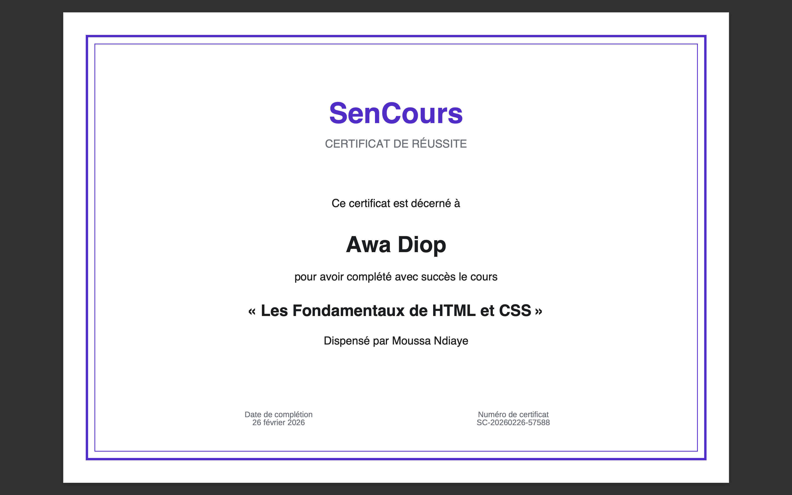
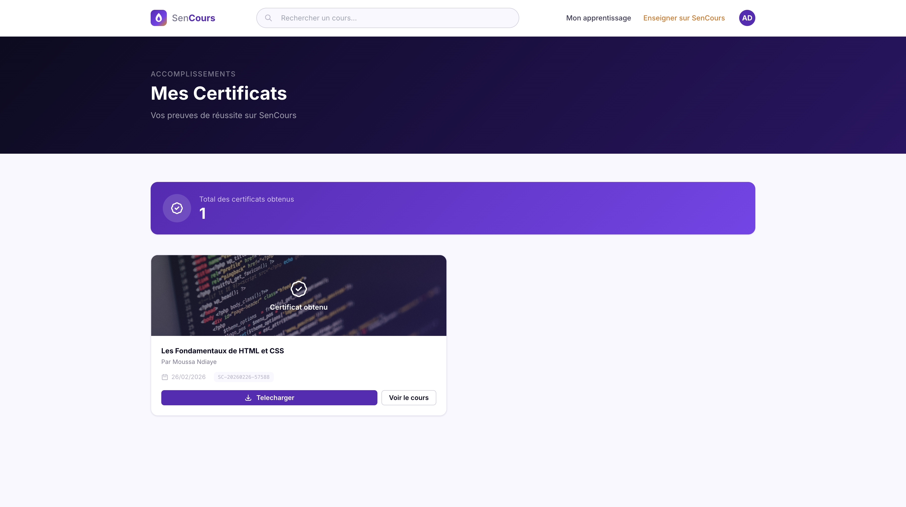
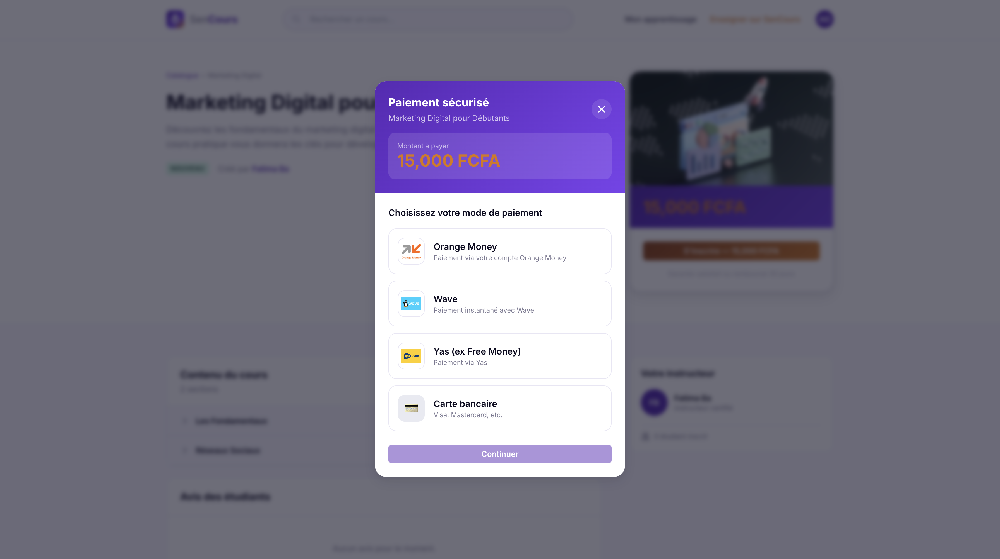
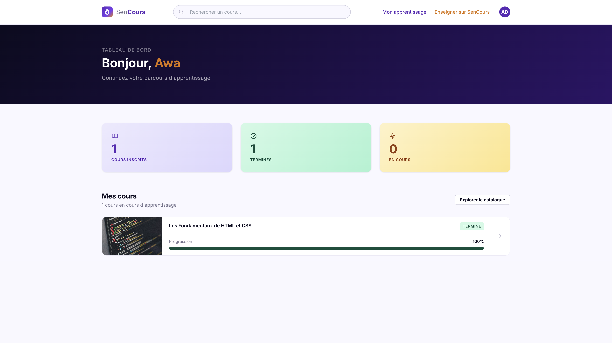
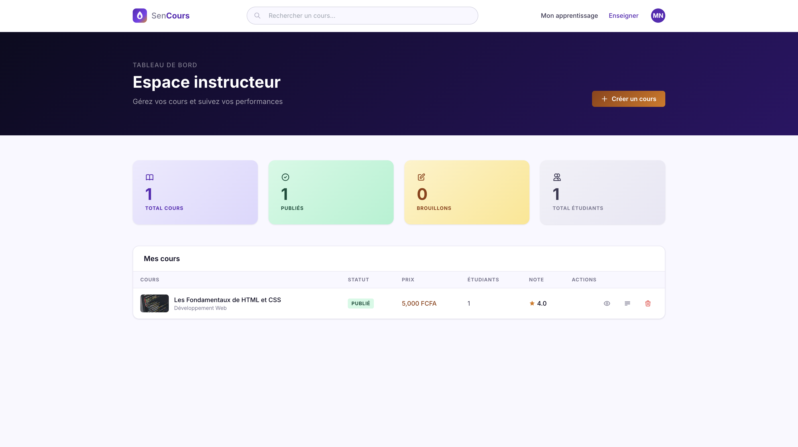
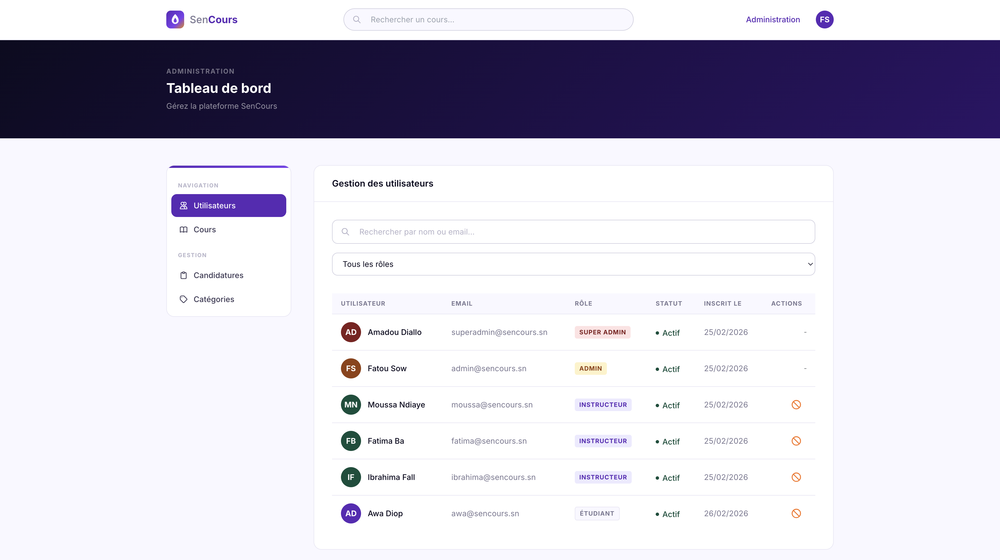

<p align="center">
  
</p>

<h1 align="center">SenCours</h1>

<p align="center">
  <strong>Plateforme e-learning sénégalaise — accédez à des cours de qualité, partout et pour tous.</strong>
</p>

<p align="center">
  
  
  
  
</p>

<p align="center">
  
  
  
</p>

---

## Sommaire

- [Aperçu](#aperçu)
- [Captures d'écran](#captures-décran)
- [Fonctionnalités](#fonctionnalités)
- [Stack technique](#stack-technique)
- [Prérequis](#prérequis)
- [Installation](#installation)
- [Architecture](#architecture)
- [Structure du projet](#structure-du-projet)
- [Design System](#design-system)
- [Scripts disponibles](#scripts-disponibles)
- [Backend](#backend)
- [Contribuer](#contribuer)
- [Auteur](#auteur)
- [Licence](#licence)

---

## Aperçu

**SenCours** est une plateforme d'apprentissage en ligne pensée pour le contexte sénégalais. Elle permet aux étudiants de découvrir et suivre des cours, aux instructeurs de créer et gérer leur contenu pédagogique, et aux administrateurs de superviser l'ensemble de la plateforme.

Le projet a été développé dans le cadre d'un mémoire de fin de formation à la **Sonatel Academy** (Orange Digital Center, Dakar).

> **Backend associé :** Ce frontend communique avec une API REST Spring Boot — [sencours-back](https://github.com/Mohmk10/sencours-back).

---

## Captures d'écran

<details>
<summary><strong>Voir toutes les captures</strong></summary>
<br />

| Vue | Aperçu |
|-----|--------|
| **Catalogue des cours** |  |
| **Détail d'un cours** |  |
| **Résultats de recherche** |  |
| **Page d'apprentissage** |  |
| **Certificat** |  |
| **Mes certificats** |  |
| **Modal de paiement** |  |
| **Dashboard étudiant** |  |
| **Dashboard instructeur** |  |
| **Dashboard administrateur** |  |

</details>

---

## Fonctionnalités

### Visiteurs (public)

| Fonctionnalité | Description |
|----------------|-------------|
| Catalogue | Parcourir les cours avec filtres par catégorie et par prix |
| Recherche avancée | Recherche instantanée avec autocomplétion et suggestions |
| Détail cours | Fiche complète : programme, instructeur, informations, inscription |
| Pages légales | À propos, conditions d'utilisation, confidentialité, contact |

### Étudiants

| Fonctionnalité | Description |
|----------------|-------------|
| Inscription / Connexion | Authentification JWT sécurisée |
| Tableau de bord | Vue d'ensemble : cours en cours, progression, statistiques |
| Apprentissage | Interface de lecture des leçons avec suivi de progression en temps réel |
| Paiement mobile | Orange Money, Wave, Yas — intégration des moyens de paiement locaux |
| Certificats | Téléchargement PDF automatique après complétion d'un cours |
| Devenir instructeur | Candidature depuis l'espace étudiant |

### Instructeurs

| Fonctionnalité | Description |
|----------------|-------------|
| Création de cours | Formulaire complet avec métadonnées et thumbnail |
| Éditeur de contenu | Gestion des sections et leçons (CRUD complet — 6 types de leçons) |
| Constructeur de quiz | QCM, Vrai/Faux, Réponses multiples |
| Dashboard instructeur | Statistiques : nombre d'étudiants, cours publiés, revenus |
| Publication | Publier / dépublier un cours |

### Administrateurs

| Fonctionnalité | Description |
|----------------|-------------|
| Gestion utilisateurs | Liste, recherche, suspension, réactivation |
| Gestion cours | Modération et supervision des cours publiés |
| Gestion catégories | CRUD catégories avec compteur de cours dynamique |
| Candidatures | Validation / rejet des demandes d'instructeur |

### Super Administrateur

| Fonctionnalité | Description |
|----------------|-------------|
| Création d'admins | Créer directement des comptes administrateurs et instructeurs |
| Gestion complète | Suspension, suppression de tous les utilisateurs |
| Zone sécurisée | Confirmation par mot de passe pour les actions sensibles |

---

## Stack technique

| Technologie | Version | Usage |
|-------------|---------|-------|
| **Angular** | 20.3 | Framework frontend (standalone components) |
| **TypeScript** | 5.9 | Langage typé |
| **Tailwind CSS** | 3.4 | Utility-first CSS |
| **SCSS** | — | Styles personnalisés et design tokens |
| **RxJS** | 7.8 | Programmation réactive |
| **Karma + Jasmine** | — | Tests unitaires |

---

## Prérequis

- **Node.js** >= 18.x
- **npm** >= 9.x
- **Angular CLI** >= 20.x

```bash
# Vérifier les versions installées
node -v
npm -v
ng version
```

---

## Installation

```bash
# 1. Cloner le dépôt
git clone https://github.com/Mohmk10/sencours-front.git
cd sencours-front

# 2. Installer les dépendances
npm install

# 3. Lancer le serveur de développement
ng serve
```

L'application sera accessible sur **http://localhost:4200**.

> Le backend Spring Boot doit être lancé séparément sur le port **8080**. Voir le dépôt [sencours-back](https://github.com/Mohmk10/sencours-back).

---

## Architecture

### Principes architecturaux

| Principe | Implémentation |
|----------|----------------|
| **Standalone Components** | Tous les composants sont autonomes (pas de NgModules) |
| **Lazy Loading** | Chaque route charge son composant à la demande |
| **Injection de dépendances** | Utilisation de `inject()` (pattern moderne Angular) |
| **Design System** | Tokens CSS custom (`--violet`, `--ink`, `--canvas`, etc.) |
| **Sécurité** | Guards de route par rôle, intercepteur JWT automatique |
| **Réactivité** | RxJS Subjects et Observables pour les flux asynchrones |

### Authentification

- **JWT** stocké dans `localStorage`
- **Interceptor fonctionnel** qui attache le token Bearer à chaque requête
- **Guards** : `authGuard`, `guestGuard`, `roleGuard`
- **Rôles** : `ETUDIANT` · `INSTRUCTEUR` · `ADMIN` · `SUPER_ADMIN`

### Recherche

- Autocomplétion avec **debounce** (300ms) via `Subject` + `switchMap`
- Historique des recherches récentes dans `localStorage`
- Filtres côté serveur : catégorie, prix, tri

---

## Structure du projet

```
src/
├── app/
│   ├── core/                    # Services, guards, interceptors, modèles
│   │   ├── guards/              # authGuard, guestGuard, roleGuard
│   │   ├── interceptors/        # JWT interceptor
│   │   ├── models/              # Interfaces TypeScript
│   │   └── services/            # Services HTTP (auth, course, user, etc.)
│   ├── features/                # Modules fonctionnels
│   │   ├── admin/               # Panneau d'administration
│   │   ├── auth/                # Login / Register
│   │   ├── become-instructor/   # Candidature instructeur
│   │   ├── certificates/        # Page Mes certificats
│   │   ├── courses/             # Catalogue, détail, formulaire, recherche
│   │   ├── dashboard/           # Dashboards étudiant & instructeur
│   │   ├── instructor/          # Éditeur de cours (sections / leçons)
│   │   ├── learn/               # Page d'apprentissage
│   │   ├── legal/               # À propos, Contact, CGU, Confidentialité
│   │   ├── super-admin/         # Dashboard super administrateur
│   │   └── suspended/           # Page compte suspendu
│   └── shared/                  # Composants réutilisables
│       └── components/          # Navbar, Footer, SearchBar, PaymentModal
├── styles.scss                  # Design system, tokens CSS, utilitaires
└── index.html
```

---

## Design System

Le projet utilise un **design system unifié** basé sur des tokens CSS :

| Token | Usage |
|-------|-------|
| `--violet` | Couleur primaire (marque) |
| `--amber` | Accents, prix |
| `--green` | Succès, gratuit |
| `--ink` / `--ink-2/3/4` | Texte (du plus foncé au plus clair) |
| `--canvas` | Arrière-plan |
| `--border` / `--border-2` | Bordures |
| `--gradient-brand` | Gradient principal |

**Classes utilitaires :** `.btn`, `.btn-primary`, `.btn-secondary`, `.input`, `.label`, `.card`, `.badge`, `.skeleton`, `.container-app`, `.page-header-brand`

---

## Scripts disponibles

| Commande | Description |
|----------|-------------|
| `ng serve` | Serveur de développement avec hot-reload |
| `ng build` | Build de production (output dans `dist/`) |
| `ng test` | Tests unitaires (Karma + Jasmine) |
| `ng build --watch` | Build en mode watch |

---

## Backend

Le backend est une API REST développée avec **Spring Boot**. Il gère :

- Authentification et autorisation JWT
- CRUD cours, sections, leçons
- Gestion des utilisateurs et rôles
- Système de paiement
- Génération de certificats PDF
- Recherche et pagination

> Dépôt backend : **[github.com/Mohmk10/sencours-back](https://github.com/Mohmk10/sencours-back)**

---

## Contribuer

Les contributions sont les bienvenues ! Consultez le fichier [CONTRIBUTING.md](CONTRIBUTING.md) pour les directives.

1. Forkez le projet
2. Créez votre branche (`git checkout -b feature/ma-fonctionnalite`)
3. Committez vos changements (`git commit -m 'feat: ajout de ma fonctionnalité'`)
4. Poussez la branche (`git push origin feature/ma-fonctionnalite`)
5. Ouvrez une Pull Request

---

## Auteur

**Mohamed Makan KOUYATÉ**

Projet réalisé dans le cadre de la formation à [Sonatel Academy](https://www.sonatelacademy.com/) — [Orange Digital Center](https://www.orangedigitalcenter.sn/), Dakar.

---

## Licence

Ce projet est distribué sous licence **MIT**. Voir le fichier [LICENSE](LICENSE) pour plus de détails.
